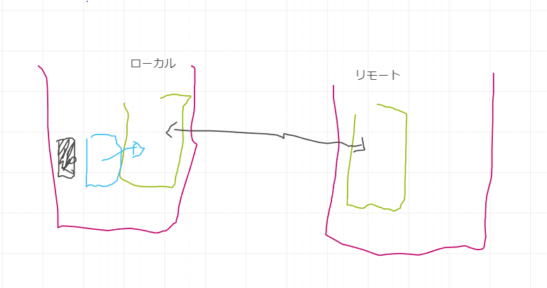

# 2024/11/15のMTGの議事録

11/15 2130-2346

ファイルを編集、追加
変更履歴を追跡する
ブランチの生成、使い方
過去のVerに遡る
比較する
ブランチをマージする
リモートリポジトリで管理する
複数人でバージョン管理する

## 今日の目的

- リポジトリを作成
- Githubリポジトリの作成
- ファイルを変更

## リポジトリを作成

- ファイルを作成する
- git init .

## ファイルを編集、追加

- ファイルを編集する
- (git statusで確認)
- git add ファイル名 でファイルをステージングエリアに移動
- git commit -m "メッセージ" でコミット(登録)を行う

## Githubにリポジトリを作成する

### ローカルでgitリポジトリを作成していない場合

- git init
- git add xxx
- git commti xxx
- git branch -M main
- git remote add origin git@github.com:xxx
- git poush -u origin main

### ローカルでgitリポジトリを作成済みの場合

- git remote add origin git@github.com:xxx でリモートブランチのURLを追加
- git branch -M main　デフォルトブランチをmainにする
- git push -u origin master

## 参考URL

- git add ってなんのためにやるの？ Gitの「ステージング」をイラストで解説します！
  - <https://kray.jp/blog/expound-git-add/>
- 【ざっくり分かるGit】originとorigin/masterとmasterの違い
  - <https://qiita.com/soiSource/items/196e59f7a4e3d2a75e20>

