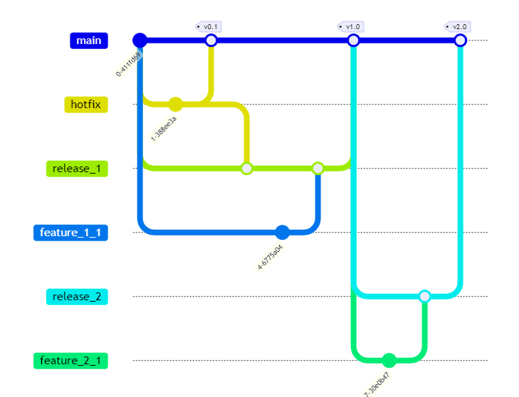

# githubのブランチ、issueなどの練習

ブランチの作り方

- main
  - 本番
- develop
  - mainから作成する
  - 開発用のブランチ
- hotfix
  - mainから作成する
  - 緊急修正で使う

main→devlop→(機能開発)→個人の作業ブランチ

参考:<https://zenn.dev/gnz/articles/6674530f61cfbe>

- タスクを作成する
- コンフリクトを起こす

2130-2420
